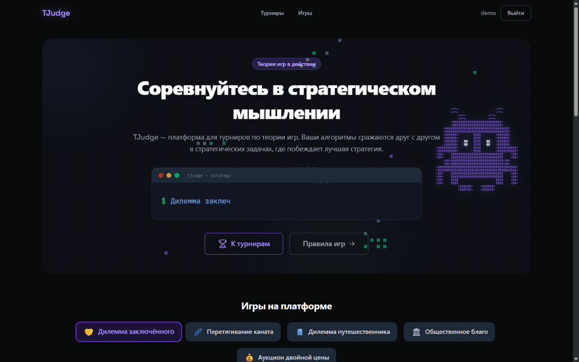

# TJudge


Турнирная платформа для соревнований программных ботов по теории игр.
Команды пишут программы-стратегии (Python, C/C++, Go, Rust, Java, JS),
система гоняет round-robin матчи в изолированных Docker-контейнерах,
считает ELO и транслирует результаты в реальном времени через WebSocket.

Стек: Go 1.26 / PostgreSQL 15 / Redis 7 / React 19.
Разработка — [BMSTU ITSTech](https://github.com/bmstu-itstech) (МГТУ им. Баумана).



## Быстрый старт

```bash
git clone https://github.com/bmstu-itstech/tjudge.git
cd tjudge
cp .env.example .env
docker network create monitoring   # внешняя сеть для метрик/логов (один раз)
docker compose up -d               # или: make docker-up (создаст сеть сам)
```

Первый запуск собирает образы (api, worker, исполнитель матчей `tjudge-cli`,
песочница компиляции `tjudge-builder`) — несколько минут. Миграции БД
применяются автоматически.

После запуска:

| Сервис | URL |
|--------|-----|
| Веб-приложение | http://localhost:8080 |
| Grafana | http://localhost:3000 (admin/admin) |
| Prometheus | http://localhost:9092 |
| Loki (логи) | http://localhost:3100 |

Назначение администратора (сначала зарегистрируйтесь через веб-интерфейс):

```bash
make admin EMAIL=your-email@example.com
```

После назначения — выйдите и войдите заново.

Деплой на свой сервер (профили по железу):

```bash
make deploy              # автоопределение профиля
make deploy-weak         # 2 ядра, 4 ГБ RAM
make deploy-medium       # 4 ядра, 8 ГБ RAM
make deploy-strong       # 8+ ядер, 16+ ГБ RAM
```

Подробнее — [docs/OPERATIONS.md](docs/OPERATIONS.md).

## Игры

Пять игр, каждая исполняется через [tjudge-cli](https://github.com/bmstu-itstech/tjudge-cli) (Rust).
Правила с протоколами взаимодействия — в веб-интерфейсе и в [руководстве](docs/USER_GUIDE.md).

| Игра | Идентификатор |
|------|---------------|
| Дилемма заключённого | `prisoners_dilemma` |
| Перетягивание каната | `tug_of_war` |
| Дилемма путешественника | `travelers_dilemma` |
| Общественное благо | `public_goods` |
| Аукцион двойной цены | `dollar_auction` |

## Архитектура

```
┌─────────────┐     ┌─────────────┐     ┌──────────────┐
│  Frontend   │────▶│     API     │────▶│  PostgreSQL  │
│  (React)    │◀────│    (Go)     │◀────│              │
└─────────────┘     └──────┬──────┘     └──────────────┘
       ▲                   │
       │ WebSocket         │
       └───────────────────┤
                     ┌─────▼─────┐
                     │   Redis   │
                     │ (очередь  │
                     │  + кэш)   │
                     └─────┬─────┘
                           │
               ┌───────────┼───────────┐
               ▼           ▼           ▼
         ┌─────────┐ ┌─────────┐ ┌─────────┐
         │ Worker  │ │ Worker  │ │ Worker  │
         └────┬────┘ └────┬────┘ └────┬────┘
              │           │           │
         ┌────▼───────────▼───────────▼────┐
         │      Docker (tjudge-cli)        │
         └─────────────────────────────────┘
```

| Компонент | Технологии |
|-----------|------------|
| Frontend | React 19, TypeScript, Tailwind CSS 4, Zustand |
| API Server | Go 1.26, Chi Router, JWT, WebSocket |
| Domain Events | In-process Event Bus — декаплинг side-effects (кэш, broadcast) от бизнес-логики |
| Worker Pool | Go, автомасштабирование 10-1000, приоритетная очередь |
| Database | PostgreSQL 15 (41 миграция), живые лидерборды по партиционированным `matches` |
| Cache/Queue | Redis 7 — кэш турниров/лидерборда, очередь матчей, rate limiting |
| Monitoring | Prometheus, Grafana, Loki, Promtail, Alertmanager; прод-стек — отдельное репо infra-monitoring (+ guardian: авто-восстановление контейнеров) |
| Executor | Docker-изолированный [tjudge-cli](https://github.com/bmstu-itstech/tjudge-cli) (Rust) |

## Разработка

```bash
# Зависимости
docker-compose up -d postgres redis    # БД и кэш
make migrate-up                        # Миграции

# Запуск (в разных терминалах)
make run-api                           # API сервер
make run-worker                        # Воркер
cd web && npm run dev                  # Фронтенд (hot reload)
```

Основные команды:

| Категория | Команда | Описание |
|-----------|---------|----------|
| Запуск | `make run-api` / `make run-worker` | API сервер / воркер |
| | `make dev` | API с hot reload (air) |
| Тесты | `make test` / `make test-race` | Unit / с детектором гонок |
| | `make test-coverage` | С HTML-отчётом покрытия |
| | `make test-integration` | Интеграционные (PostgreSQL + Redis) |
| | `make test-e2e` | End-to-end (запущенный сервер) |
| Сборка | `make build` / `make docker-build` | Бинарники / Docker образы |
| Качество | `make lint` / `make fmt` / `make security` | golangci-lint / формат / gosec + govulncheck |
| БД | `make migrate-up` / `make migrate-down` | Применить / откатить миграции |
| | `make admin EMAIL=...` | Назначить администратора |
| Бэкапы | `make backup` / `make restore BACKUP=...` | Создать / восстановить бэкап БД |
| Диагностика | `make status` / `make doctor` | Статус в терминале / глубокая проверка |

Тесты трёх уровней: unit (бизнес-логика, handlers, middleware, cache, worker,
websocket), integration (PostgreSQL-репозитории и очередь — нужны БД и Redis),
e2e (HTTP API через запущенный сервер). Подробнее — [docs/SETUP.md](docs/SETUP.md).

CI/CD (GitHub Actions): `ci` (фронтенд + линт, тесты, сборка, интеграционные)
и `release` по тегу `v*` — сборка образов (версия вшивается в `/system/status`),
выкладка на сервер, верификация запущенной версии и пост-деплойный doctor
(упавшая проверка валит деплой).

## API

Основные эндпоинты (полный справочник — [docs/openapi.yaml](docs/openapi.yaml), Swagger UI на `/swagger/` под админом):

| Метод | Путь | Описание |
|-------|------|----------|
| `POST` | `/api/v1/auth/register` | Регистрация |
| `POST` | `/api/v1/auth/login` | Авторизация (JWT) |
| `POST` | `/api/v1/auth/refresh` | Обновление токена |
| `GET` | `/api/v1/auth/me` | Текущий пользователь |
| `GET` | `/api/v1/tournaments` | Список турниров |
| `POST` | `/api/v1/tournaments` | Создать турнир |
| `POST` | `/api/v1/tournaments/:id/join` | Присоединиться к турниру |
| `POST` | `/api/v1/tournaments/:id/start` | Запустить турнир |
| `GET` | `/api/v1/tournaments/:id/leaderboard` | Лидерборд по игре |
| `GET` | `/api/v1/tournaments/:id/cross-game-leaderboard` | Кросс-игровой лидерборд |
| `GET` | `/api/v1/tournaments/:id/active-game` | Текущая активная игра |
| `POST` | `/api/v1/teams` | Создать команду |
| `POST` | `/api/v1/teams/join` | Присоединиться по коду |
| `POST` | `/api/v1/programs` | Загрузить программу |
| `GET` | `/api/v1/games` | Список игр |
| `GET` | `/api/v1/system/health` | Здоровье системы (admin) |
| `WS` | `/api/v1/ws/tournaments/:id` | Real-time обновления |

## Документация

| Документ | Описание |
|----------|----------|
| [docs/USER_GUIDE.md](docs/USER_GUIDE.md) | Участие в турнирах, стратегии, правила игр, добавление игры |
| [docs/SETUP.md](docs/SETUP.md) | Локальная разработка, окружение, схема БД |
| [docs/OPERATIONS.md](docs/OPERATIONS.md) | Деплой, runbook, бэкапы, мониторинг |
| [docs/openapi.yaml](docs/openapi.yaml) | Полный справочник REST API (Swagger на `/swagger/`) |

## Лицензия

MIT License. См. [LICENSE](LICENSE).
